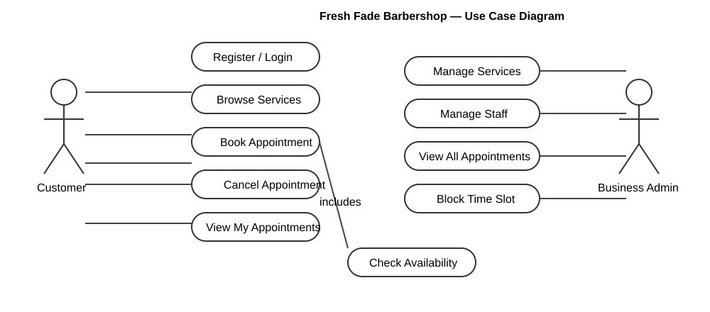
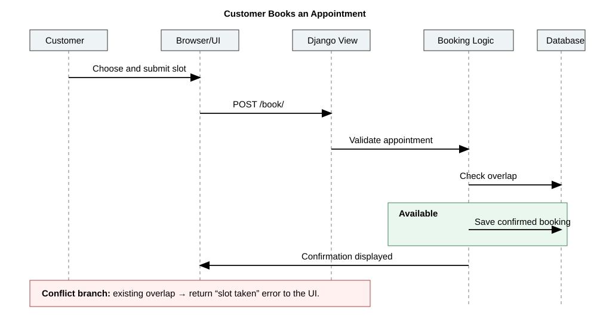
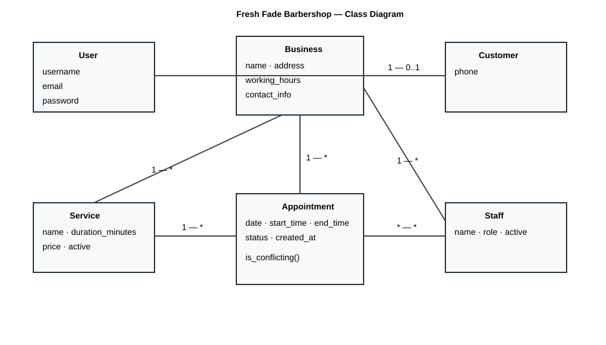

# Fresh Fade Barbershop Scheduling System

**Course:** SEN 310  
**System:** Fresh Fade Barbershop personal scheduling web application

## 1. User stories

1. As a customer, I want to register an account, so that I can make and manage appointments securely.
2. As a customer, I want to browse available services and book an appointment with a preferred barber, so that I can reserve a convenient grooming time.
3. As a customer, I want to cancel an upcoming appointment, so that the time can be made available when my plans change.
4. As a business admin, I want to view all bookings for a given day, so that I can plan staffing and service delivery.
5. As a business admin, I want to block unavailable time, so that customers cannot book a barber when they are unavailable.
6. As a business admin, I want to add or edit a service, so that the online catalogue reflects current offerings, prices, and durations.

## 2. Use case diagram

### Use case descriptions

**Register / Login.** A customer uses this before booking or reviewing appointments. The customer supplies valid account credentials; on success Django authenticates the user and opens an authenticated session.

**Browse Services.** A customer may view active services without being logged in. The system presents each service's name, duration, and price; the customer can then proceed to booking.

**Book Appointment (includes Check Availability).** An authenticated customer selects a service, a barber, a future date, and a start time. The system verifies that the barber provides the service and that no active appointment overlaps the calculated end time. On success it stores a confirmed appointment and shows an on-screen confirmation; on conflict it preserves the form and shows an error.

**Cancel Appointment.** An authenticated customer may cancel only their own pending or confirmed appointment. The system changes its status to cancelled, freeing that time for a later booking, and displays confirmation.

**View My Appointments.** An authenticated customer requests their appointment list. The system retrieves their non-cancelled appointments, ordered by date and time, and displays their service, barber, time, and status.

**Manage Services / Manage Staff.** A Business Admin signs in to Django admin. The admin can create, update, deactivate, or remove service and staff records, and assign services to staff. The revised data is available to the booking interface.

**View All Appointments.** A Business Admin opens the appointment list in Django admin, optionally filtering by day, status, or barber. The system shows all bookings and lets the admin mark completed appointments.

**Block Time Slot.** A Business Admin creates an Appointment with status `blocked` and no customer or service. The normal overlap check treats it as an active appointment, preventing customer bookings within its time range.

## 3. Sequence diagram

### Sequence description

1. The customer selects a service, barber, future date, and start time in the browser and submits the booking form.
2. The browser sends a POST request to the Django booking view, which binds and validates the form.
3. The form calculates the end time from the service duration and builds a candidate Appointment.
4. The Appointment model queries active appointments for the same barber and date using the overlap rule: existing start is before candidate end **and** existing end is after candidate start.
5. If no overlap exists, Django saves a confirmed appointment in a database transaction and returns the customer’s appointments page with a confirmation message.
6. If an overlap exists (or another validation rule fails), no booking is saved and the UI displays a slot-taken error so the customer can choose another time.

## 4. Class diagram

### Class descriptions

**Business** stores the barbershop’s public information: name, description, address, working hours, and contact details. A Business has many Service and Staff records.

**Service** belongs to one Business and supplies a name, duration in minutes, price, and active flag. A Service can be offered by many staff members and can appear in many appointments.

**Staff** belongs to one Business and has a name, role, active flag, and a many-to-many relationship to Service. This relationship ensures customers can only choose services performed by their selected barber.

**User and Customer.** Django’s built-in User supplies account identity, password handling, and authentication. Customer is a one-to-one profile that extends User with a phone number. A User may own many appointments; blocked times intentionally have no customer.

**Appointment** connects one staff member, optional customer, optional service, date, start time, end time, status, notes, and creation timestamp. Its `is_conflicting()` method implements the overlap query. Foreign keys give each Staff member and Service a one-to-many relationship with appointments.

## 5. Hosted link

**Live application URL:** _To be assigned when the repository is deployed to Render._

The production entry point is configured for Render using `build.sh` and `Procfile`; set `SECRET_KEY`, `ALLOWED_HOSTS`, and optionally `DATABASE_URL` in the host dashboard. Django admin is available at `/admin` after creating an administrator account. For grading, create a dedicated demo admin in the deployed environment rather than publishing credentials in this document.
